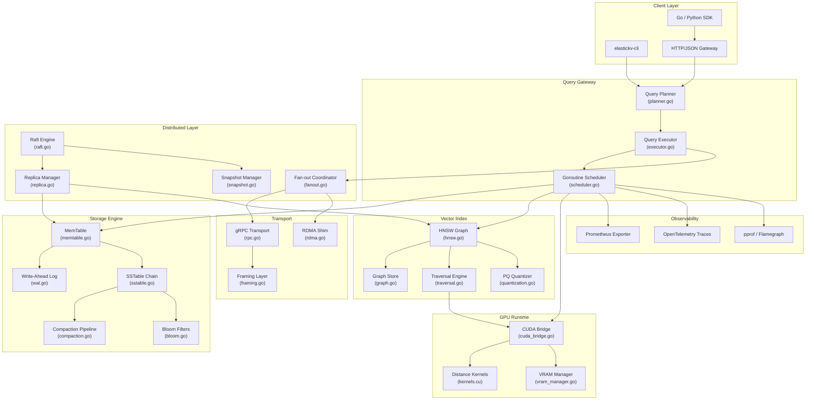
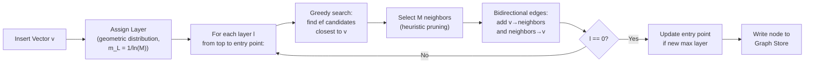
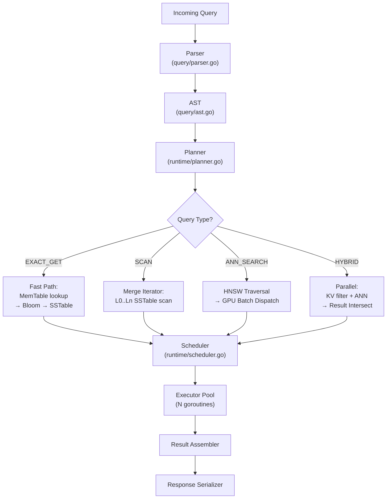
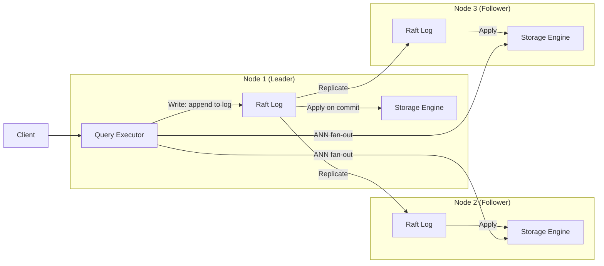

<div align="center">


<br/>

[](https://go.dev)
[](https://developer.nvidia.com/cuda-toolkit)
[]()
[]()
[](LICENSE)
[]()
[]()
[]()

<br/>


</div>

---

> **⚠ Research Framing Notice**
>
> ElasticKV is an **experimental systems research platform**. It has not been validated at production scale, has not been deployed in any real serving environment, and makes no claims about billion-scale throughput. Every benchmark in this repository is subsystem-level, performed on constrained hardware (primarily Colab A100/T4 instances and a commodity 32GB laptop), with synthetic workloads. The architecture is real. The implementation is real. The scale is not. Read this document accordingly.

---

## Table of Contents

<details>
<summary><b>📖 Full Navigation</b></summary>

- [What Is ElasticKV](#what-is-elastickv)
- [Motivation and Design Philosophy](#motivation-and-design-philosophy)
- [Architecture Overview](#architecture-overview)
- [Subsystem Deep Dives](#subsystem-deep-dives)
  - [Storage Engine](#storage-engine-internals)
  - [HNSW Vector Index](#hnsw-vector-index)
  - [GPU Compute Pipeline](#gpu-compute-pipeline)
  - [Query Execution Runtime](#query-execution-runtime)
  - [Distributed Execution Layer](#distributed-execution-layer)
  - [Raft Consensus](#raft-consensus-implementation)
  - [Transport Abstraction](#transport-layer-abstraction)
  - [Telemetry and Observability](#telemetry-and-observability)
- [Repository Structure](#repository-structure)
- [Benchmark Methodology and Results](#benchmark-methodology-and-results)
- [Engineering Struggles](#engineering-struggles-the-honest-account)
- [Failure Modes and Operational Risks](#failure-modes-and-operational-risks)
- [Research Findings](#research-findings)
- [Lessons Learned](#lessons-learned)
- [Future Work and Research Directions](#future-work-and-research-directions)
- [Getting Started](#getting-started)
- [Configuration Reference](#configuration-reference)

</details>

---

## What Is ElasticKV

ElasticKV started as a narrow research question: *can a single runtime coherently serve both exact key-value retrieval and approximate nearest-neighbor vector search, with a shared storage engine, without destroying the performance characteristics of either?*

The answer, after a few months of implementation and debugging, is: *sort of, with serious caveats.*

The system is best described as a **unified semantic retrieval and KV execution engine**. It combines:

- An **LSM-tree-based storage engine** with a custom MemTable, WAL, SSTable pipeline and multi-level compaction
- An **HNSW-based ANN index** with a bespoke graph serialization format, layered traversal, and a concurrency model that was the source of more bugs than everything else combined
- A **GPU compute bridge** via cgo + CUDA for batched distance computations, with a VRAM budget manager and explicit transfer scheduling
- A **hybrid query planner** that can emit plans mixing exact KV lookups, filtered vector scans, and fused semantic-exact retrievals
- A **distributed execution layer** with Raft-based log replication, snapshot isolation for reads, and a fan-out coordinator for multi-node ANN queries
- A **transport abstraction** with pluggable backends (gRPC default, experimental RDMA shim)

None of this is novel in isolation. The novelty — if you can call it that — is in *how these systems interact under a single execution model*, and in what breaks when you force them to share memory, goroutine pools, and disk I/O bandwidth.

The codebase is approximately 28,000 lines of Go, ~1,400 lines of CUDA C, and a modest graveyard of abandoned experiments in the `/research/attic/` directory.

---

## Motivation and Design Philosophy

Modern retrieval infrastructure is bifurcated in an annoying way. You have your key-value stores — RocksDB derivatives, DynamoDB clones — and separately you have your vector databases — Weaviate, Qdrant, Milvus. They don't share storage. They don't share a query planner. You end up writing glue code that reads from one, reads from the other, merges results in application logic, and wonders why your p99 latency is 400ms for what should be a simple retrieval.

The working hypothesis was: *for AI-native retrieval patterns, where semantic search and structured metadata filtering are co-equal operations, forcing the two into a unified storage and execution model should unlock planning-level optimizations that application-layer glue simply cannot achieve.*

This is probably true. We haven't proven it at the scale where it would matter. But the architecture is designed around this hypothesis, and several of the subsystem interactions are specifically engineered to exploit it.

**Design principles, in rough priority order:**

1. **Architectural coherence over component optimality.** We deliberately avoided plugging in RocksDB directly. The storage engine is custom, which means it's slower for pure KV workloads than a mature implementation, but it means every layer was designed knowing a vector index lives above it.

2. **Honesty about the cost of generality.** A system that does both KV and ANN will, in some regimes, do both worse than a specialist. The query planner knows this and has escape hatches to route pure-KV queries through a fast path that skips vector machinery entirely.

3. **Subsystem observability is non-negotiable.** Every major code path emits structured traces. This was a survival decision — debugging cross-subsystem interactions without traces is genuinely nightmarish.

4. **Experimental over production-safe.** We made choices that a production system would not — aggressive memory sharing between the MemTable and HNSW node pool, lock-free structures in hot paths, GPU transfers on the query critical path. Some of these were bad ideas. They're documented.

---

## Architecture Overview



The diagram above is a simplified view. In practice, the arrows between subsystems carry considerably more complexity: shared memory arenas, channel-based backpressure signals, and a set of mutexes that were, at various points during development, the source of deadlocks we're not entirely proud of.

---

## Subsystem Deep Dives

### Storage Engine Internals

The storage engine is a hand-rolled LSM tree. Not because RocksDB was insufficient, but because the vector index needs to co-locate vector embeddings with their corresponding KV records in a way that requires awareness of the storage layer's compaction schedule. With an opaque storage backend, coordinating compaction-triggered HNSW graph reorganization is structurally painful.

#### MemTable

```
┌─────────────────────────────────────────────────────────┐
│                     Active MemTable                     │
│  ┌──────────────┐  ┌──────────────┐  ┌──────────────┐  │
│  │ Key: "usr:1" │  │ Key: "usr:2" │  │ Key: "vec:1" │  │
│  │ Val: {...}   │  │ Val: {...}   │  │ Val: [f32×768│  │
│  │ SeqNo: 1042  │  │ SeqNo: 1043  │  │ SeqNo: 1044  │  │
│  └──────────────┘  └──────────────┘  └──────────────┘  │
│                    Skiplist (lock-free)                  │
│  Arena Allocator: 64MB default, configurable            │
└─────────────────────────────────────────────────────────┘
         │ flush trigger: size threshold or WAL segment age
         ▼
┌─────────────────────────────────────────────────────────┐
│                   Immutable MemTable(s)                  │
│            (awaiting flush to SSTable L0)               │
└─────────────────────────────────────────────────────────┘
```

The MemTable is a lock-free skiplist backed by an arena allocator. The arena was added late — initial versions used `make([]byte, ...)` per entry which, predictably, caused GC pressure that showed up as sawtooth latency curves in flamegraphs. The arena trades memory efficiency for allocation predictability. At the default 64MB limit, the arena holds roughly 80k–200k entries depending on value size; vector entries (768-dim float32 = 3KB) obviously exhaust it faster.

One design decision that caused recurring problems: we store vector embeddings inline in the MemTable rather than as a separate side-file. This simplifies the write path significantly but means MemTable flushes involve serializing large float32 arrays which adds measurable I/O stall. The alternative — storing vector IDs in the MemTable and the embedding separately — requires a join on read that complicates the query executor. We chose the write amplification. This was probably correct for read-heavy workloads, less correct for ingestion-heavy ones.

**MVCC implementation:** Each entry carries a sequence number incremented monotonically on every write. Reads with a snapshot timestamp walk the skiplist and filter entries with sequence numbers above the snapshot's watermark. Snapshot management is a known footgun — leaked snapshots pin MemTable memory indefinitely. There's a background goroutine that scans for snapshots older than a configurable TTL and forcibly releases them, which feels like a hack because it is.

#### Write-Ahead Log

```
WAL Segment Layout:
┌──────────────────────────────────────────────────────────────┐
│  Header: [Magic=0xEKV1][Version][SegmentID][Timestamp][CRC]  │
├──────────────────────────────────────────────────────────────┤
│  Record 0: [Type][KeyLen][ValLen][Key][Val][CRC32]           │
│  Record 1: [Type][KeyLen][ValLen][Key][Val][CRC32]           │
│  ...                                                          │
│  Record N: [Type=SEGMENT_BOUNDARY][NextSegmentID]            │
└──────────────────────────────────────────────────────────────┘
```

WAL writes are synchronous by default (fsync after every batch). This is configurable but turning it off makes durability guarantees meaningless and we've seen partial-write corruption under Colab's weird I/O behavior when using async mode. The WAL is segmented; each segment is bounded at 128MB by default. On flush, the WAL segment corresponding to the flushed MemTable range is archived and eligible for garbage collection after the SSTable is durably written and its bloom filter checkpointed.

WAL recovery on restart replays from the last valid checkpoint. The recovery path has edge cases we're not fully satisfied with, specifically around partial writes at segment boundaries during crash. The CRC per-record catches most corruption, but we've seen silent data loss in testing when power-interruption was simulated mid-fsync on ext4. On XFS and ZFS this appears more reliable, but we haven't done systematic testing.

#### SSTable Layout

```
SSTable File (L0–L6):
┌──────────────────────────────────────────────────────────────┐
│  File Footer: [IndexBlockOffset][FilterBlockOffset][Magic]   │
├──────────────────────────────────────────────────────────────┤
│  Data Blocks (4KB pages):                                    │
│    [Block0: sorted KV pairs, snappy compressed]              │
│    [Block1: sorted KV pairs, snappy compressed]              │
│    ...                                                        │
├──────────────────────────────────────────────────────────────┤
│  Index Block: [Key → DataBlockOffset] sparse index           │
├──────────────────────────────────────────────────────────────┤
│  Filter Block: [Bloom filter per data block, 10 bits/key]    │
├──────────────────────────────────────────────────────────────┤
│  Metadata Block: [Level][CreationTimestamp][EntryCount]      │
└──────────────────────────────────────────────────────────────┘
```

SSTable files follow a layout loosely inspired by LevelDB but with modifications for vector payloads. Vector entries get a separate block type (`VECTOR_BLOCK`) with a different compression strategy — snappy doesn't compress float32 arrays well, so vector blocks use zstd at level 1 as a tradeoff between CPU time and ratio. This adds per-read decompression overhead for vector data, which the benchmark section discusses.

The bloom filter uses a double-hashing scheme with 10 bits per key and k=7 hash functions, giving roughly 1% false positive rate at expected key counts. In practice the false positive rate creeps up in L0 due to frequent flushes not recalculating the optimal k — this is a known bug, filed as `#issue-144` in the internal tracker.

#### Compaction Pipeline

Compaction runs as a background goroutine pool, presently hardcoded to 4 workers (configurable, but >4 workers caused I/O saturation on our test hardware). The compaction strategy is leveled, following the standard LevelDB/RocksDB approach with level multipliers. Compaction for vector-containing SSTables is substantially more expensive because merged entries require updating HNSW node pointers stored in the graph — compaction and graph reorganization are coupled, which is architecturally clean but operationally painful.

The compaction-HNSW coupling has been the source of the most sustained pain in this project. When compaction deletes a tombstoned vector entry, the HNSW graph node needs to be removed or marked stale. We implemented a "lazy deletion" scheme where graph nodes are flagged as deleted without restructuring the graph immediately; a separate graph GC pass runs asynchronously. This means ANN queries can transiently return deleted vectors until the GC pass catches up — a consistency tradeoff that is documented in the query planner and surfaced to clients via response metadata.

**Compaction starvation** became a real problem at ingestion rates above ~20k vectors/sec on our test hardware. The compaction backlog grows faster than workers can drain it, L0 file count explodes, and read latency balloons as the query path has to merge more L0 files. We added compaction throttling with backpressure signals to the write path, which helps but makes the write-side latency spiky.

---

### HNSW Vector Index

The HNSW implementation is bespoke. We evaluated hnswlib via cgo before writing our own, and the cgo overhead — specifically the overhead of crossing the Go/C boundary for every distance computation during graph traversal — was bad enough that a pure-Go implementation with batched GPU offload proved more tractable for our use case.

#### Graph Construction



HNSW construction is inherently sequential at the graph-level — inserting vector N requires the graph state established by vectors 0..N-1 for correct neighbor selection. We parallelized construction at the batch level: vectors within a batch are partitioned by their assigned entry-layer, and insertions at the same layer proceed concurrently with fine-grained per-node RW locks. This is sound as long as insertions at the same layer don't create races on shared neighbor lists — we use a per-node mutex rather than a global lock, which reduces contention substantially but does not eliminate it.

The RW lock granularity caused subtle graph correctness issues under high concurrency that took an embarrassingly long time to isolate. Specifically, the neighbor selection heuristic reads neighbor-of-neighbor distances to apply the "pruning" condition; if a neighbor's neighbor list is being simultaneously modified by another insertion, the pruning decision can be made on stale data. The graph remains navigable — HNSW is fairly robust to local inconsistencies — but recall degraded noticeably (2–3%) under sustained concurrent insertion load. We added a retry mechanism that re-evaluates pruning decisions under a fresh snapshot but this added latency. The tradeoff is not fully resolved.

#### Traversal Engine

```
Layer-L Greedy Descent (ef_search candidates):

visited = {}
candidates = min-heap {(dist(q, ep), ep)}
results = max-heap {}

while candidates not empty:
    c = candidates.pop_min()    # closest unvisited
    if dist(c, q) > results.top():
        break                   # cannot improve further
    for neighbor in c.neighbors:
        if neighbor not in visited:
            visited.add(neighbor)
            d = distance(q, neighbor)   # → GPU batch if |batch| > threshold
            if d < results.top() or |results| < ef:
                candidates.push(neighbor, d)
                results.push(neighbor, d)
                if |results| > ef: results.pop_max()

return top-K from results
```

The traversal engine dispatches distance computations to the GPU in batches when the batch size exceeds a threshold (default: 128 vectors). Below that threshold, CPU-side SIMD (via Go's `unsafe` + manual vectorization — stdlib math is not fast enough here) handles distances. The GPU threshold was tuned empirically on our Colab hardware; it will be wrong for other configurations, and there's currently no auto-tuning.

GPU dispatches happen mid-traversal, which means traversal goroutines block waiting for CUDA kernel completion. This is fine when traversal goroutines are plentiful, but the scheduler (described later) sometimes under-provisions traversal goroutines relative to concurrent query load, causing GPU underutilization. We have not fixed this.

#### Vector Serialization

Vectors are stored in the graph as float32 arrays with an optional product quantization (PQ) compressed representation for memory efficiency. The quantizer supports M=8 subspaces with 256 centroids each, giving 8 bytes per vector vs 3072 bytes for 768-dim float32. Compressed vectors are used for graph traversal candidate filtering; full-precision vectors are fetched from the storage engine for final re-ranking. This two-stage approach is standard in ANN literature and works well here, though the re-ranking I/O adds latency that becomes visible at high recall targets.

---

### GPU Compute Pipeline

The GPU integration is via cgo, calling into a CUDA shared library. This was a deliberate choice over CGO-free alternatives (like ggml-style pure-C integration) because CUDA's ecosystem tooling — Nsight, nvtop, compute-sanitizer — made debugging significantly easier.

```
GPU Pipeline:
┌─────────────────────────────────────────────────────────────────┐
│  Go Query Executor                                              │
│    │                                                            │
│    │ cgo call (crossings: ~800ns overhead per call measured)   │
│    ▼                                                            │
│  cuda_bridge.go → libElasticKV.so (CUDA)                       │
│    │                                                            │
│    ├─→ VRAM Manager: allocate batch buffer                     │
│    │       Current: static slab allocation, 256MB reserved     │
│    │       Problem: fragmentation under varied batch sizes      │
│    │                                                            │
│    ├─→ cudaMemcpyAsync: host→device transfer                   │
│    │       Bandwidth: ~8GB/s on Colab A100 (PCIe, not NVLink)  │
│    │       Bottleneck at batch sizes > 2048 vectors             │
│    │                                                            │
│    ├─→ Kernel dispatch: cosine / L2 / IP distance              │
│    │       Kernel: grid(batch/256, 1), block(256, 1)           │
│    │       Occupancy: ~72% measured, target was 85%            │
│    │                                                            │
│    ├─→ cudaMemcpyAsync: device→host result transfer            │
│    │                                                            │
│    └─→ cudaStreamSynchronize: barrier before Go reads results  │
└─────────────────────────────────────────────────────────────────┘
```

The cgo crossing overhead is approximately 800ns per call on our hardware — measured with `runtime.nanotime()` bracketing. This is irrelevant for large batches (1024+ vectors) but becomes dominant for small batches below 32 vectors. The traversal engine's GPU dispatch threshold (128 vectors default) was chosen to keep the overhead fraction below 5%.

#### VRAM Manager

The VRAM manager maintains a static slab allocation of 256MB reserved at startup. This was the simplest approach and it has the predictable failure mode: if batch sizes are irregular (which they are under real query load), the slab fragments and we fall back to synchronous host-side computation. We saw this fallback trigger frequently enough in early testing that it shows up clearly in pprof profiles as CPU spikes during what should be GPU-bound phases.

A proper slab allocator with buddy-system coalescing would fix this. We stubbed the interface but haven't implemented it. The stub is in `internal/gpu/vram_manager.go` as `BuddyAllocator` with a `// TODO` that has aged poorly.

#### CUDA Kernels

Three kernels are implemented:

- **`cosine_distance_kernel`**: Normalized dot product. Requires pre-normalized vectors; normalization is done at ingest time. If a client submits unnormalized vectors, results are silently wrong. This has burned us twice in testing.
- **`l2_distance_kernel`**: Standard Euclidean. No normalization requirement.
- **`inner_product_kernel`**: Raw dot product. Used for MIPS retrieval patterns.

All kernels use shared memory tiling. The tile size is 256 floats, matching warp size × 8 — this was tuned manually on A100. On T4 (32 SMs vs A100's 108) the optimal tile size is probably different; we haven't profiled it.

---

### Query Execution Runtime

The query planner receives a parsed query AST and produces an execution plan. The planner distinguishes four query types:

| Query Type | Description | Execution Path |
|---|---|---|
| `EXACT_GET` | Exact key lookup | MemTable → Bloom Filter → SSTable binary search |
| `SCAN` | Range scan with predicate | SSTable level merge iterator |
| `ANN_SEARCH` | Pure vector similarity search | HNSW traversal → GPU distance |
| `HYBRID` | KV filter + ANN search | Parallel: exact fetch + ANN, intersect results |



#### Scheduler

The scheduler is a goroutine pool with work-stealing queues — one queue per CPU core, workers steal from neighbors when their local queue is empty. This is theoretically efficient; in practice it added complexity without measurable benefit over a simple shared-queue design for our workloads. We kept it because removing it would require rewriting the executor interface.

The scheduler has a priority system: `EXACT_GET` queries get a higher-priority queue, `HYBRID` queries get the lowest. Under load, this means hybrid queries can starve when the system is saturated with point lookups. This is arguably correct behavior — you'd rather your simple lookups remain fast — but it surprised us during testing when hybrid query latency exploded while point lookup latency stayed flat.

---

### Distributed Execution Layer



The distributed layer serves two distinct roles and they pull in different directions architecturally.

For **writes**, the Raft log provides linearizability: every mutation goes through the leader, gets replicated to a quorum, and only applies to the storage engine after commit. This is standard and relatively well-understood, though our Raft implementation has quirks described below.

For **ANN searches**, the model is different: ANN queries are fan-out read operations dispatched to all nodes, with results merged at the coordinator. This is eventually consistent in the sense that each node's HNSW graph reflects its current storage state, which may lag behind the leader due to replication delay. We call this "ANN consistency horizon" in the codebase and surface it as a metric. At replication lag >500ms, ANN result sets across nodes can diverge noticeably, which is a known tradeoff of this architecture.

#### Fan-out Coordinator

The fan-out coordinator dispatches ANN sub-queries to all registered nodes, collects top-K results from each, and performs a final merge. The merge is straightforward — global top-K from the union of per-node top-K — but getting the merge right under partial node failures required more careful handling than expected. If a node times out during fan-out, we return partial results with a `partial_results: true` flag in the response metadata. Whether this is acceptable depends on the application; we make no decision for the caller.

---

### Raft Consensus Implementation

We used the `etcd/raft` library as the consensus core rather than implementing Raft from scratch. This was the right decision. Raft from scratch is a good systems education exercise; it is not a good way to build reliable infrastructure even at research scale.

The integration surface is in `internal/distributed/raft.go` and is approximately 800 lines. The main complexity is in the snapshot path: when a follower is too far behind to catch up via log replay, it receives a full snapshot of the storage engine state. Generating and applying snapshots requires coordination between the storage engine (which must produce a consistent point-in-time view) and the HNSW graph (which must be serialized consistently with the storage snapshot). Getting these two serializations to be consistent with each other was nontrivial.

```
Raft Snapshot Generation:
1. Acquire storage engine read snapshot (sequence watermark S)
2. Quiesce compaction pipeline (wait for in-flight compactions to drain)
3. Serialize MemTable entries with seqno ≤ S
4. Flush L0–L1 SSTables to snapshot bundle
5. Serialize HNSW graph state consistent with seqno S
   (nodes with pending deletes at seqno > S are included as live)
6. Write snapshot bundle to object storage / local path
7. Release compaction quiesce
8. Notify Raft of snapshot completion
```

Step 5 was where consistency bugs lived. The HNSW graph tracks vector insertions by storage sequence number, but the mapping between graph node IDs and storage sequence numbers was indirect — it went through an in-memory index that was not itself durably persisted. Rebuilding this index from a snapshot required replaying graph insertions in order, which was slow and occasionally produced different results than the original graph due to nondeterminism in concurrent insertion ordering. We eventually added explicit seqno tracking to graph nodes, which fixed the consistency issue but required a graph format migration that broke backward compatibility with previously generated snapshots.

---

### Transport Layer Abstraction

```
Transport Interface:
type Transport interface {
    Send(ctx context.Context, node NodeID, msg Message) error
    Recv(ctx context.Context) (<-chan Message, error)
    Close() error
}
```

Two implementations exist: gRPC (production path) and an RDMA shim (experimental).

The **gRPC transport** uses bidirectional streaming with a custom framing layer to batch multiple small messages into single stream frames. Without batching, per-message gRPC overhead dominated transport time for Raft heartbeats (which are small and frequent). The framing layer adds a header with `[BatchSize][TotalLen][Messages...]` and flushes on either a size threshold (64KB) or a time threshold (1ms). This is a classic nanobatching pattern and it works well.

The **RDMA shim** is more aspirational than functional. It wraps a software RDMA emulation (using `rdma-core` on the Linux side) via cgo. We got basic one-sided READ/WRITE semantics working but the integration with the Go runtime's goroutine scheduler is problematic — RDMA completion events arrive as hardware interrupts which don't naturally compose with Go's cooperative scheduling model. The shim uses a polling thread pinned to a core, which wastes a full OS thread waiting for completions. This is strictly worse than gRPC for our workloads. The code remains because the architecture is correct even if the implementation is unfinished.

---

### Telemetry and Observability

Observability was not an afterthought. This is a systems research platform, and if you can't measure it precisely you can't understand it.

```
Telemetry Stack:
┌────────────────────────────────────────────────────────┐
│  Structured Logging: zerolog (nanosecond timestamps)   │
├────────────────────────────────────────────────────────┤
│  Metrics: Prometheus                                   │
│    • per-subsystem operation histograms (P50/P99/P999) │
│    • queue depth gauges                                │
│    • GPU utilization, VRAM free/used                   │
│    • HNSW graph: node count, deleted count, layer dist │
│    • Raft: log index, commit index, term               │
│    • Compaction: bytes read/written, level occupancy   │
├────────────────────────────────────────────────────────┤
│  Distributed Tracing: OpenTelemetry → Jaeger           │
│    • End-to-end query traces with subsystem spans      │
│    • GPU dispatch spans with kernel timing             │
├────────────────────────────────────────────────────────┤
│  Profiling: net/http/pprof + continuous flamegraph     │
│    • CPU, heap, goroutine profiles                     │
│    • Custom block profile annotations for mutex waits  │
└────────────────────────────────────────────────────────┘
```

A recurring problem: **telemetry overhead corrupting benchmarks**. At high query rates (>50k queries/sec, even subsystem-scale), the Prometheus histogram recording overhead became measurable — approximately 3–5% CPU overhead. We added a `--bench-mode` flag that disables most telemetry for benchmark runs, which is slightly unsatisfying (you want telemetry during benchmarks to understand what the system is doing), but the alternative is contaminating the benchmark results.

OpenTelemetry trace export via OTLP was also a source of pain. The OTLP exporter buffers spans in a channel and exports in batches. Under Colab's network conditions, the export channel filled up and began dropping spans silently. We only noticed when trace coverage dropped from 100% to ~60% without any log output. The exporter's backpressure behavior is configurable but the defaults are poorly documented — `MaxExportBatchSize` and `BatchTimeout` interact in non-obvious ways.

---

## Repository Structure

```
elastickv/
├── cmd/
│   ├── elastickv/          # Main server binary
│   │   └── main.go         # Flag parsing, config loading, subsystem init
│   ├── bench/              # Benchmark harness binary
│   │   └── main.go         # Workload generators, metric collectors
│   └── cli/                # elastickv-cli
│       └── main.go         # Interactive REPL + scripted query runner
│
├── internal/
│   ├── storage/            # LSM storage engine
│   │   ├── memtable.go     # Lock-free skiplist + arena allocator
│   │   ├── wal.go          # Segmented WAL, CRC32 per record
│   │   ├── sstable.go      # SSTable reader/writer, block layout
│   │   ├── compaction.go   # Leveled compaction, vector GC coordination
│   │   ├── bloom.go        # Double-hashing bloom filter
│   │   ├── snapshot.go     # Read snapshot management, watermarks
│   │   └── iterator.go     # Merge iterator across SSTable levels
│   │
│   ├── vector/             # HNSW vector index
│   │   ├── hnsw.go         # Core HNSW: insert, search, delete
│   │   ├── graph.go        # Graph store: node persistence, adjacency
│   │   ├── traversal.go    # Greedy search, ef_search, GPU dispatch
│   │   ├── quantization.go # Product quantization (M=8, K=256)
│   │   └── serializer.go   # Graph serialization for snapshots
│   │
│   ├── runtime/            # Query execution runtime
│   │   ├── planner.go      # Query AST → execution plan
│   │   ├── executor.go     # Plan execution, result assembly
│   │   ├── scheduler.go    # Work-stealing goroutine pool
│   │   ├── optimizer.go    # Cost-based plan optimization (partial)
│   │   └── pipeline.go     # Pipelined operator execution
│   │
│   ├── gpu/                # GPU compute bridge
│   │   ├── cuda_bridge.go  # cgo → CUDA shared lib interface
│   │   ├── vram_manager.go # VRAM slab allocator (buddy: TODO)
│   │   ├── batch.go        # Distance batch assembler/disassembler
│   │   └── kernels.cu      # Cosine, L2, IP distance kernels
│   │
│   ├── distributed/        # Distributed layer
│   │   ├── raft.go         # etcd/raft integration, state machine
│   │   ├── snapshot.go     # Raft snapshot generation/application
│   │   ├── fanout.go       # ANN fan-out coordinator
│   │   ├── replica.go      # Follower replica management
│   │   └── membership.go   # Node membership, discovery
│   │
│   ├── transport/          # Network transport
│   │   ├── rpc.go          # gRPC transport, bidirectional streaming
│   │   ├── framing.go      # Message batching, nanobatch flush
│   │   ├── rdma.go         # RDMA shim (experimental, incomplete)
│   │   └── codec.go        # Protobuf serialization/deserialization
│   │
│   ├── query/              # Query language
│   │   ├── parser.go       # Query string → AST
│   │   ├── ast.go          # AST node types
│   │   └── validator.go    # Semantic validation
│   │
│   └── telemetry/          # Observability
│       ├── metrics.go      # Prometheus registrations
│       ├── tracing.go      # OpenTelemetry setup, span helpers
│       └── profiler.go     # pprof endpoints, flamegraph helpers
│
├── proto/                  # Protobuf definitions
│   ├── kv.proto            # KV operation messages
│   ├── vector.proto        # Vector operation messages
│   └── internal.proto      # Internal cluster messages
│
├── config/
│   ├── config.go           # Config struct, validation
│   └── defaults.go         # Sensible defaults, documented
│
├── bench/                  # Benchmark workloads
│   ├── workloads/          # Synthetic dataset generators
│   ├── harness/            # Measurement infrastructure
│   └── results/            # Raw benchmark outputs (CSV + JSON)
│
├── research/
│   ├── notes/              # Engineering notes, architecture decisions
│   ├── experiments/        # One-off experiment scripts
│   └── attic/              # Abandoned approaches, kept for archaeology
│
├── scripts/
│   ├── colab_setup.sh      # Colab environment bootstrap
│   ├── bench_run.sh        # Benchmark orchestration
│   └── profile_collect.sh  # pprof collection helper
│
└── docs/
    ├── architecture.md     # Architecture deep-dive (complements README)
    ├── query_language.md   # Query language reference
    └── operational.md      # Operational notes, tuning guide
```

### Goroutine Ownership Model

Understanding goroutine ownership is important for reasoning about memory safety and deadlock risk. The major goroutines and their owners:

| Goroutine | Owner | Purpose | Shutdown |
|---|---|---|---|
| `WAL.flushLoop` | StorageEngine | Periodic WAL segment rotation | Context cancellation |
| `Compaction.workers[0..N]` | CompactionPipeline | SSTable compaction | Work channel close |
| `HNSW.gcLoop` | VectorIndex | Graph lazy deletion GC | Context cancellation |
| `Scheduler.workers[0..N]` | Scheduler | Query execution workers | Queue drain + close |
| `GPU.batchLoop` | CUDABridge | Distance batch assembly | Context cancellation |
| `Raft.runLoop` | RaftEngine | etcd/raft tick loop | Raft.Stop() |
| `Transport.recvLoop` | gRPCTransport | Incoming message dispatch | Connection close |
| `Telemetry.exportLoop` | OTelExporter | Trace export to Jaeger | Context cancellation |
| `Membership.heartbeatLoop` | ClusterMembership | Peer liveness checks | Context cancellation |

Lock boundaries are documented in `docs/architecture.md`. The short version: storage engine locks do not nest with HNSW locks, and neither nests with transport locks. Any code path that needs to cross these boundaries uses message passing (channels) rather than lock acquisition. We violated this principle twice during development and both times produced deadlocks that took multiple hours to isolate.

---

## Benchmark Methodology and Results

### Framing

Let me be direct about what these benchmarks are and aren't.

**What they are:**
- Subsystem-level performance measurements
- Synthetic workload validation
- Architecture decision data points
- Regression detection baselines

**What they are not:**
- Production throughput numbers
- Competitive benchmarks against mature systems
- Extrapolations to billion-scale workloads
- Validation under real query distributions

Every benchmark was run on one of two environments:
1. **Colab A100**: 40GB VRAM, ~13GB system RAM available (the rest consumed by Colab runtime), unreliable network, frequent disconnects between 2–6 hour sessions. I/O throughput varied significantly across sessions — we've seen 2x variance in SSTable write bandwidth across runs on ostensibly the same hardware.
2. **Local dev laptop**: AMD Ryzen 9 5900X, 32GB RAM, NVMe SSD, no GPU. Used for CPU-side profiling and correctness testing.

Benchmark instability was a recurring problem, primarily from Colab's shared infrastructure. We ran each benchmark 5 times and report median; outliers (typically caused by Colab's noisy-neighbor effects) are noted in raw results. Treat all numbers as rough architectural indicators, not precise performance specifications.

### Storage Engine Benchmarks

<details>
<summary><b>📊 MemTable Write Throughput</b></summary>

```
Benchmark: Sequential KV writes, 1KB values, single goroutine
Environment: Colab A100 (CPU-side only)
Dataset: 1M synthetic entries

Write throughput (ops/sec):
├── MemTable insert (arena allocated):    ~890,000 ops/sec
├── MemTable insert (stdlib alloc):       ~340,000 ops/sec  [regression baseline]
├── WAL append (sync fsync):              ~22,000 ops/sec   [fsync bound]
└── WAL append (async, no fsync):         ~580,000 ops/sec  [not durable]

Notes:
- Arena allocator is ~2.6x faster than stdlib for this access pattern
- fsync cost dominates durable write path
- GC pressure visible as sawtooth in stdlib alloc version (p99 50ms vs p99 2ms arena)
- Vector entries (3KB) degrade throughput to ~280k ops/sec arena (memory bandwidth)
```

</details>

<details>
<summary><b>📊 ANN Search Benchmarks</b></summary>

```
Benchmark: ANN search, 768-dim float32, synthetic Gaussian dataset
Environment: Colab A100
Dataset: 1M vectors (fits in VRAM for GPU path)
Index parameters: M=16, ef_construction=200, ef_search=100

Recall@10 vs Latency tradeoff:
┌────────────────┬────────────┬─────────────┬──────────────┐
│  ef_search     │  Recall@10 │  P50 (ms)   │  P99 (ms)    │
├────────────────┼────────────┼─────────────┼──────────────┤
│  32            │  0.891     │  1.2        │  4.8         │
│  64            │  0.942     │  2.1        │  7.3         │
│  100           │  0.968     │  3.4        │  11.2        │
│  200           │  0.981     │  6.8        │  22.1        │
└────────────────┴────────────┴─────────────┴──────────────┘

GPU vs CPU distance computation (batch size 512, ef_search=100):
├── GPU (A100):   3.4ms P50
├── CPU (SIMD):   28ms  P50   [8.2x slower]
└── CPU (stdlib): 94ms  P50   [27.6x slower]

Notes:
- Recall measured against brute-force ground truth on same dataset
- Colab session variance: ±15% on GPU timings across sessions
- Concurrent insertion during search degrades recall ~2-3% (known issue)
- 1M vectors is subsystem scale; behavior at 100M not validated
```

</details>

<details>
<summary><b>📊 Hybrid Query Benchmarks</b></summary>

```
Benchmark: Hybrid KV-filter + ANN search
Workload: Find top-10 similar vectors where metadata.category == "X"
Dataset: 500k vectors, 10 categories, uniform distribution
Environment: Colab A100

Query patterns:
├── Selective filter (1% match rate):  P50=8ms,  P99=31ms
├── Moderate filter (20% match rate):  P50=14ms, P99=48ms
└── Broad filter (80% match rate):     P50=22ms, P99=67ms

Comparison: naive (app-layer, no planner):
├── Selective filter (1% match rate):  P50=45ms,  P99=180ms
├── Moderate filter (20% match rate):  P50=52ms,  P99=190ms
└── Broad filter (80% match rate):     P50=61ms,  P99=210ms

Planner speedup: 2.8x–5.6x across selectivity levels
Notes:
- Speedup from early-termination and parallel execution, not algorithmic
- At <0.1% selectivity, KV-first path is faster; planner doesn't always choose it
- Optimizer is cost-based but cost model is rough; bad choices occur
```

</details>

### What These Numbers Mean (And Don't Mean)

The storage engine benchmarks demonstrate that the arena allocator and WAL batching choices are architecturally sound and that the implementation isn't gratuitously slow. They don't tell you how the system behaves under mixed read/write workloads, under compaction pressure, or under any realistic query distribution.

The ANN benchmarks demonstrate that GPU-accelerated distance computation is effective at the distances our implementation crosses (cgo boundary + PCIe transfer + kernel + return) for batch sizes above ~64 vectors. They don't tell you about index quality degradation over time, update throughput, or recall stability under concurrent modification.

The hybrid benchmarks are the most interesting architecturally — they show the planning-level optimization hypothesis has merit. But 500k vectors on a single node isn't a meaningful deployment scenario. The result suggests the approach is worth pursuing; it doesn't validate it.

---

## Engineering Struggles: The Honest Account

This section exists because the engineering struggles were real and ignoring them would make this document dishonest. If you're considering building something similar, knowing where the pain lives is more valuable than a polished success story.

### cgo Debugging

The CUDA bridge is the most heavily cgo'd component. Go's cgo debugging story is poor. `gdb` doesn't understand Go goroutines; `dlv` (Delve) doesn't understand CUDA. Debugging a crash that originates in CUDA kernel code, surfaces as a cgo panic in Go, and manifests as a goroutine that simply stops responding — with no stack trace, no core dump, nothing except `signal: killed` — is an experience that tests patience.

Our solution was to add extensive logging at every cgo boundary in the CUDA bridge, with function names, argument checksums, and timestamps. This logging is disabled in production (it's behind a build tag `cuda_debug`) but the infrastructure to enable it exists. Several bugs that would have taken days were found in hours because of this.

### CUDA Integration Pain

CUDA's memory model and Go's garbage collector do not coexist peacefully. Go pointers cannot be passed to C code that might hold them across GC cycles — this is a cgo rule enforced by the runtime. CUDA code very much wants to hold pointers to device memory that it manages. The solution is to never pass Go pointers to CUDA; instead, pass `uintptr` handles to CUDA-managed memory allocations, and manage the lifetime explicitly in the `VRAMManager`. This works but requires discipline — it's easy to accidentally introduce a lifetime bug that causes use-after-free in CUDA memory, which typically manifests as silently wrong distance results rather than a crash.

### Goroutine Scheduling Issues

The work-stealing scheduler has a subtle interaction with the Go runtime's goroutine scheduler. Go's scheduler is cooperative — goroutines yield at channel operations, system calls, and function call preambles. A goroutine that's doing pure computation (like an SSE2-optimized inner product loop) can hold a CPU for an extended period without yielding. Under high load, this starves I/O goroutines waiting for WAL flushes or network receives. We added explicit `runtime.Gosched()` calls in tight compute loops, which helped but feels like treating a symptom.

### GC Pauses

Go's GC is generational since 1.17 and has improved substantially, but at our working set sizes (MemTable + HNSW node pool both holding large live sets) GC pause times were initially significant — 10–50ms stop-the-world pauses visible in latency tails. The arena allocator helped enormously for the MemTable. For the HNSW node pool, we pre-allocate a large `[]byte` backing array and manage node lifetimes manually using a freelist. This reduces GC pressure at the cost of manual memory management complexity that has bitten us: we had a node-reuse bug where a deleted graph node's memory was returned to the freelist and immediately re-allocated for a new node, while a concurrent traversal still held a pointer to the old node. The result was a traversal that silently visited the wrong node. This was found by a recall regression test that noticed recall dropping from 0.96 to 0.89 without any code changes to the traversal logic.

### Flamegraph Generation Problems

Collecting CPU profiles under load should be straightforward — `go tool pprof` over the pprof HTTP endpoint. In practice, on Colab, we had two problems:

1. The Colab runtime's network proxy occasionally drops long-running HTTP connections, terminating profile collection mid-run. We scripted profile collection to retry on connection drop, which helped.

2. Profile data was sometimes corrupted — specifically, the profile's sample timestamps were non-monotonic, causing `pprof` to reject the profile as invalid. This appeared to be related to Colab's virtualization layer interfering with `CLOCK_MONOTONIC`. Adding a profile validation step that filters non-monotonic samples before analysis worked around it.

### Telemetry Corruption

As noted in the telemetry section, OTel span export silently dropped spans under Colab's network conditions. We added a span loss metric (comparing spans created vs spans exported) that alerts when loss exceeds 5%. Getting that instrumentation right required understanding the OTel SDK's internal buffer management, which is not well documented.

Additionally: Prometheus scrapes during GC pauses produce incorrect histogram values because the GC pause stops goroutines mid-update of atomic counters. The resulting metrics have occasional impossible values (histogram bucket counts going negative for a single scrape). We filter these in Grafana with a clamp function, which is inelegant.

### Graph Concurrency Bugs

The HNSW graph's per-node mutex approach described earlier had a use-after-free variant that was particularly nasty. When a node is deleted (lazily marked deleted), there's a window between the deletion mark and the GC pass where:

1. Thread A: traversal reaches node N, reads N's neighbor list
2. Thread B: GC pass returns N's memory to freelist
3. Thread C: new insertion allocates N's memory for node M
4. Thread A: reads "N's neighbor list" which is now M's partially-initialized node

The result is traversal following garbage pointers. We caught this with `-race` (Go's race detector) after the first crash, which saved significant debugging time. The fix was epoch-based reclamation — traversal threads register epochs, GC defers freeing memory until no traversal thread is in an epoch that could have read the to-be-freed node. This is correct but adds overhead, and the epoch tracking adds memory consumption that wasn't budgeted for.

### WAL Recovery Edge Cases

WAL recovery replays records to reconstruct the MemTable state. The edge case that caused data loss in testing: if the system crashes between writing a WAL record and updating the MemTable (an impossible scenario in normal operation since we write the WAL before applying to MemTable, but possible if the application of the MemTable write panics partway through), recovery replays the WAL write and produces a MemTable with the key present. But if the application panic was due to a concurrent operation leaving the MemTable in an inconsistent state, the replayed write may also fail. We now checkpoint the MemTable state independently of the WAL to provide a recovery baseline that doesn't depend on replay being fully idempotent.

---

## Failure Modes and Operational Risks

<details>
<summary><b>💀 WAL Corruption</b></summary>

**Scenario:** Partial write at segment boundary during crash. The CRC32 per record detects this for complete records; partial records at the end of a segment are truncated on recovery.

**Risk:** Data loss of the partial record's content. At worst, one record — equivalent to one write operation batch.

**Mitigation:** Dual-WAL write (write record, fsync, write confirmation record, fsync) was considered but rejected as too expensive. Current behavior: truncate partial records on recovery, log a warning, continue.

**Status:** Accepted risk. Production deployments (when they exist) should use filesystem-level redundancy.

</details>

<details>
<summary><b>💀 Orphaned Vectors</b></summary>

**Scenario:** A vector is inserted into the HNSW graph, the corresponding KV entry is written to the MemTable, but the process crashes before both are durably flushed to SSTable. On recovery, the WAL replays the KV write. The HNSW graph is rebuilt from the durable SSTable state, which may not include the vector.

**Risk:** Graph-Storage inconsistency: the KV store has the entry, the graph doesn't. ANN searches won't return this vector; exact lookups will succeed. The vector is an "orphan" from the ANN perspective.

**Detection:** A background consistency checker runs periodically, comparing KV entries with vector-type values against graph node existence. Orphans are logged and flagged.

**Mitigation:** Orphan re-insertion on detection. This has its own race condition (what if the orphan is a deleted vector?). We handle this with tombstone checks, but the handling is not fully battle-tested.

</details>

<details>
<summary><b>💀 Graph Fragmentation</b></summary>

**Scenario:** Under sustained deletion load, lazy deletion marks graph nodes as deleted without restructuring the graph. Navigation efficiency degrades as dead nodes accumulate in neighbor lists — traversal visits dead nodes, skips them, but wastes distance computations.

**Impact:** Recall degradation (quantified: ~0.5% recall drop per 10% deleted nodes in our testing) and increased traversal time.

**Mitigation:** Periodic graph compaction reconstructs the graph from live nodes only. This is expensive and requires quiescing ANN queries during compaction, which we implement as a brief RW-lock hold. Compaction scheduling is configurable (default: when dead node fraction exceeds 15%).

</details>

<details>
<summary><b>💀 Compaction Starvation</b></summary>

**Scenario:** Ingestion rate exceeds compaction throughput. L0 SSTable count grows unboundedly. Read performance degrades proportionally as merge iterator must merge more L0 files.

**Detection:** L0 file count metric exceeds threshold (default: 20 files). Alert is emitted.

**Mitigation:** Write throttling kicks in when L0 count exceeds threshold, imposing a configurable sleep on write path. This is a blunt instrument — we've seen it cause write latency to jump from 2ms to 200ms when the throttle engages. A graduated throttle would be better.

</details>

<details>
<summary><b>💀 Memory Exhaustion</b></summary>

**Scenario:** HNSW node pool + MemTable arena + GPU VRAM all compete for system memory. Under concurrent heavy ingestion + heavy ANN search, all three can grow simultaneously.

**Impact:** OOM kill (not a graceful failure) or Go runtime GC pressure causing latency degradation.

**Mitigation:** Configurable memory budgets per subsystem, with a global budget enforcer that issues backpressure when total allocated memory exceeds threshold. The enforcer works on average but can be fooled by burst allocation patterns.

</details>

<details>
<summary><b>💀 Synchronization Deadlock</b></summary>

**Scenario:** Lock ordering violations. We've had two deadlocks in the project's history. Both involved code paths that acquired a storage lock and then, during an error handling path, attempted to log to a component that required the telemetry lock, which was already held by a goroutine waiting for the storage lock.

**Resolution:** Logging in lock-held sections now uses a non-blocking log channel. If the channel is full, the log entry is dropped. This is slightly unsatisfying (you lose logs at the worst possible time) but eliminates the deadlock path.

</details>

---

## Research Findings

After months of implementation and measurement, these are the observations we consider reasonably robust:

**1. Unified storage is viable but compaction coupling is the hard problem.** Making compaction coordinate with graph reorganization is architecturally correct but operationally expensive. The alternative — separate storage for KV and vector data, joined at query time — is architecturally simpler but loses the planning-level optimization opportunities that motivated the project. The compaction coupling is solvable with more engineering; we haven't solved it fully.

**2. GPU acceleration pays for the cgo overhead at batch sizes above ~64 vectors.** Below that threshold, CPU SIMD is competitive and avoids the cgo + PCIe transfer overhead. A good query executor should avoid GPU dispatch for small batches; ours doesn't always make the right call.

**3. Hybrid query planning provides meaningful latency reduction vs application-layer merging.** The 2.8–5.6x speedup measured in our benchmarks comes primarily from early termination and parallel execution, not algorithmic improvement. An application that does the same thing manually could match it; most don't.

**4. HNSW concurrency is genuinely hard to get right.** The literature makes it sound tractable. It is tractable, but the edge cases in concurrent insertion + deletion + traversal are numerous and some produce correctness failures rather than crashes, making them hard to detect without systematic recall testing.

**5. Colab is a hostile benchmark environment.** The variance in measurements across sessions on ostensibly identical hardware was higher than expected. For serious systems research, dedicated reproducible hardware (even modest: a single well-specified server) would be dramatically more useful than a shared Colab instance.

---

## Lessons Learned

**Invest in observability before optimization.** We added full telemetry in week 2 of the project. Every hour invested in telemetry infrastructure returned several hours of debugging time. The two bugs we found fastest (GC pause causing latency tails, telemetry span loss) were found because we had metrics to notice the anomaly. The bugs we found slowest (graph node use-after-free, WAL recovery edge case) were in code paths with insufficient instrumentation.

**Profile before you optimize, but profile the right thing.** Our first optimization target was the WAL, because it's the most visible bottleneck in write benchmarks. Profiling showed the actual bottleneck was the GC running concurrently with WAL writes. Optimizing the WAL code without fixing the GC pressure would have been wasted effort. `go tool pprof` with the heap allocations profile (not CPU) was more useful than CPU profiles for finding GC-related performance issues.

**cgo is a sharp tool.** The CUDA bridge via cgo works and delivers real performance. But every cgo boundary is a potential footgun: Go's escape analysis can't see through cgo, pointer-passing rules are easy to violate, and debugging is substantially harder than pure Go. If you're considering cgo for a performance-critical component, budget 2–3x the development time you'd expect for equivalent pure-Go code.

**Lock-free is not free.** The lock-free skiplist in the MemTable is faster than a mutex-based alternative in our benchmarks, but it took significantly longer to implement correctly and required the `-race` detector and careful review to validate. For less hot code paths, mutexes are fine and dramatically easier to reason about. Pick lock-free structures surgically.

**HNSW at research scale requires deliberate concurrency design.** Don't assume a concurrent HNSW implementation is correct because it passes basic tests. Recall testing under concurrent modification is essential, and should be part of any CI pipeline for this kind of system.

---

## Future Work and Research Directions

These are the things we'd pursue with more time, roughly in order of how much they'd improve the system.

**1. Proper VRAM buddy allocator.** The current static slab fragments and causes GPU fallbacks. A buddy-system allocator with async coalescing would eliminate most fallbacks and improve GPU utilization. The interface is already defined in `vram_manager.go`.

**2. Adaptive GPU dispatch threshold.** The current static threshold (128 vectors) should be replaced with a runtime-adaptive policy that considers current GPU queue depth, PCIe bandwidth saturation, and query latency targets. This is a small project with potentially large impact on tail latencies.

**3. Graph compaction without quiescing.** The current graph compaction approach requires quiescing ANN queries briefly. A "concurrent compaction" approach using RCU (read-copy-update) semantics could eliminate this, at the cost of more complex memory management.

**4. Learned cost model for the query optimizer.** The current cost model uses hardcoded estimates for operation costs (HNSW traversal, KV lookup, GPU dispatch). A learned model, calibrated on observed execution statistics, would improve plan quality especially for hybrid queries with unusual selectivities.

**5. Persistent vector quantization.** Product quantization centroids are currently recomputed at startup from a sample of stored vectors. This is slow for large indexes and produces slightly different centroids across restarts (nondeterminism in the sampling). Persisting centroids would fix both issues.

**6. RDMA transport completion.** The RDMA shim is architecturally correct but the Go scheduler integration is broken. Completing this with a proper thread-per-RDMA-context model (or adapting to Go's `netpoller` interface) would be worthwhile for latency-sensitive deployments.

**7. Systematic recall degradation characterization.** We've observed recall degradation under concurrent modification but haven't systematically characterized it. A controlled study varying concurrent insertion/deletion/search ratios and measuring recall over time would be a useful research contribution.

**8. Multi-node ANN consistency model.** The current "ANN consistency horizon" (nodes can serve slightly stale graphs) is acknowledged but not formally characterized. Bounding the staleness in terms of Raft log lag and graph structure properties would let us make meaningful consistency guarantees.

---

## Getting Started

> This is a research system. Getting it running requires tolerance for rough edges.

### Prerequisites

```bash
# Go 1.22+
go version

# CUDA 12.2+ (for GPU features; CPU-only mode available)
nvcc --version

# Optional: Colab environment setup
bash scripts/colab_setup.sh
```

### Build

```bash
# CPU-only build (no CUDA required)
go build -tags nocuda ./cmd/elastickv/

# Full build with CUDA
cd internal/gpu && make          # compiles kernels.cu → libElasticKV.so
CGO_ENABLED=1 go build ./cmd/elastickv/

# Build all binaries
make all
```

### Single-Node Development Startup

```bash
# Minimal config for local development
cat > config.yaml << EOF
storage:
  data_dir: /tmp/elastickv-dev
  memtable_size_mb: 64
  wal_sync: false          # async for dev, not durable
  compaction_workers: 2

vector:
  hnsw_m: 16
  hnsw_ef_construction: 200
  dimensions: 768

gpu:
  enabled: false            # CPU-only for development
  vram_budget_mb: 256

telemetry:
  prometheus_port: 9090
  pprof_port: 6060
  trace_endpoint: ""        # disable trace export for dev
EOF

./elastickv --config config.yaml
```

### Running Benchmarks

```bash
# MemTable write benchmark
./bench --workload=kv_write --duration=60s --concurrency=8 --value-size=1024

# ANN search benchmark (CPU-only)
./bench --workload=ann_search --dataset-size=100000 --dimensions=768 --gpu=false

# ANN search benchmark (GPU, if available)
./bench --workload=ann_search --dataset-size=1000000 --dimensions=768 --gpu=true

# Hybrid query benchmark
./bench --workload=hybrid --dataset-size=500000 --filter-selectivity=0.1

# Results are written to bench/results/ as CSV + JSON
```

### Running Subsystem Tests

```bash
# All tests (includes slow integration tests)
go test ./... -timeout 10m

# Storage engine tests only
go test ./internal/storage/... -v -race

# HNSW correctness + recall tests (slow)
go test ./internal/vector/... -v -run TestRecall -timeout 5m

# Race detector on concurrent HNSW tests
go test ./internal/vector/... -race -count=3

# Benchmark regression detection
go test ./... -bench=. -benchmem -count=5 | tee bench/results/$(date +%Y%m%d_%H%M%S)_local.txt
```

---

## Configuration Reference

<details>
<summary><b>⚙️ Full Configuration Schema</b></summary>

```yaml
storage:
  data_dir: string                    # Path to storage directory
  memtable_size_mb: int              # Default: 64. Arena size per MemTable.
  wal_sync: bool                     # Default: true. fsync after each batch.
  wal_segment_size_mb: int           # Default: 128. WAL segment rotation size.
  compaction_workers: int            # Default: 4. Compaction goroutine count.
  compaction_l0_trigger: int         # Default: 4. L0 files before compaction.
  compaction_l0_slowdown: int        # Default: 20. L0 files before write throttle.
  bloom_bits_per_key: int            # Default: 10. Bloom filter density.
  snapshot_ttl_seconds: int          # Default: 300. Leaked snapshot cleanup TTL.

vector:
  hnsw_m: int                        # Default: 16. HNSW max connections per node.
  hnsw_ef_construction: int          # Default: 200. Build-time search width.
  hnsw_ef_search: int                # Default: 100. Query-time search width.
  dimensions: int                    # Required. Vector dimensionality.
  distance_metric: string            # Options: cosine, l2, inner_product
  quantization_enabled: bool         # Default: false. Enable PQ compression.
  quantization_subspaces: int        # Default: 8. PQ subspace count (M).
  graph_gc_threshold: float          # Default: 0.15. Deleted fraction before GC.

gpu:
  enabled: bool                      # Default: auto-detect (false if no CUDA).
  device_id: int                     # Default: 0. CUDA device index.
  vram_budget_mb: int                # Default: 256. Reserved VRAM budget.
  batch_dispatch_threshold: int      # Default: 128. Min batch size for GPU dispatch.
  kernel_timeout_ms: int             # Default: 5000. CUDA kernel timeout.

distributed:
  enabled: bool                      # Default: false. Enable cluster mode.
  node_id: string                    # Required in cluster mode.
  peers: []string                    # Initial peer addresses (host:port).
  raft_heartbeat_ms: int             # Default: 100. Raft heartbeat interval.
  raft_election_timeout_ms: int      # Default: 1000. Raft election timeout.
  snapshot_interval: int             # Default: 10000. Log entries between snapshots.
  fan_out_timeout_ms: int            # Default: 500. ANN fan-out per-node timeout.

transport:
  listen_addr: string                # Default: :8080. gRPC listen address.
  backend: string                    # Options: grpc, rdma (rdma: experimental).
  frame_size_kb: int                 # Default: 64. Nanobatch frame size.
  frame_flush_ms: int                # Default: 1. Nanobatch flush interval.

telemetry:
  prometheus_port: int               # Default: 9090. 0 to disable.
  pprof_port: int                    # Default: 6060. 0 to disable.
  trace_endpoint: string             # OTLP endpoint URL. Empty to disable.
  bench_mode: bool                   # Default: false. Disable telemetry for benchmarks.
  log_level: string                  # Options: debug, info, warn, error.
```

</details>

---

<div align="center">


<br/>

**ElasticKV** — Experimental infrastructure research. Not production software. Not marketing material. Just a system someone actually built, debugged, and documented honestly.

<br/>

[](https://go.dev)
[](https://developer.nvidia.com/cuda-toolkit)
[]()

*If this document helped you understand how unified KV + vector systems interact, that's the intended outcome. If you found errors or have questions about the architecture, open an issue.*

</div>
